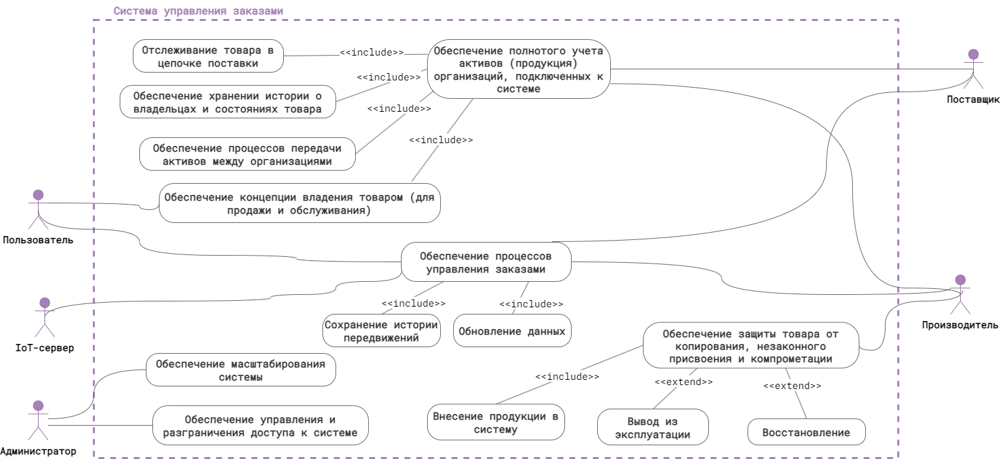
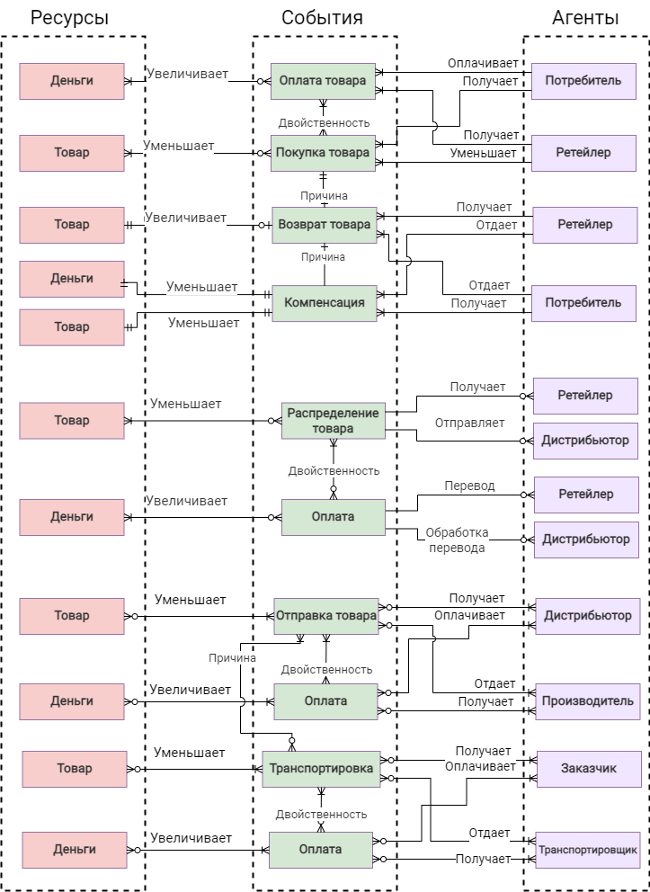
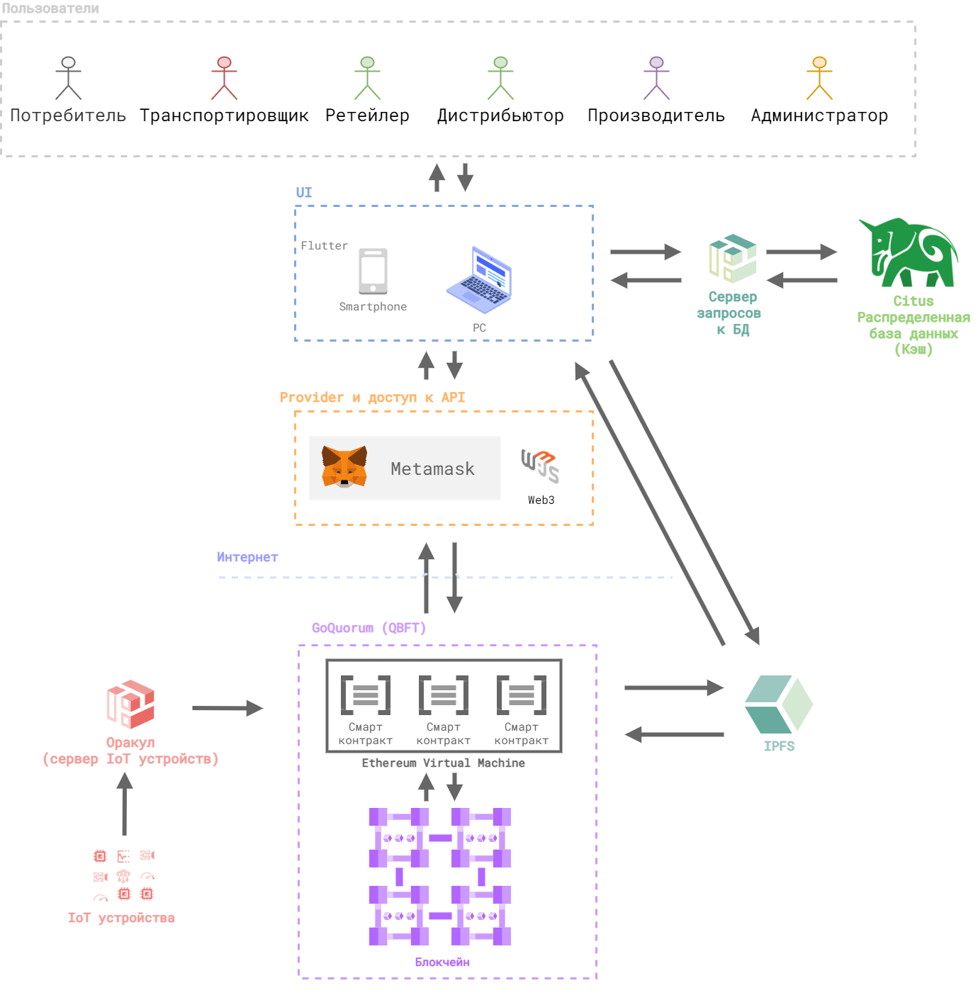
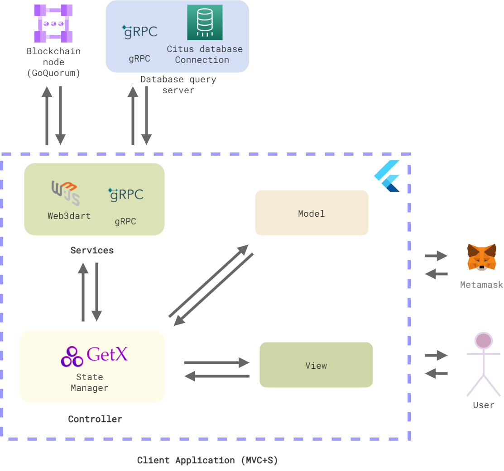
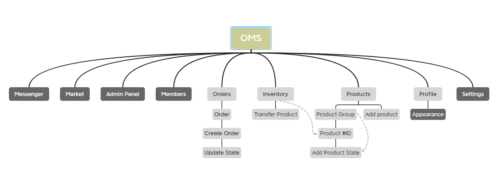
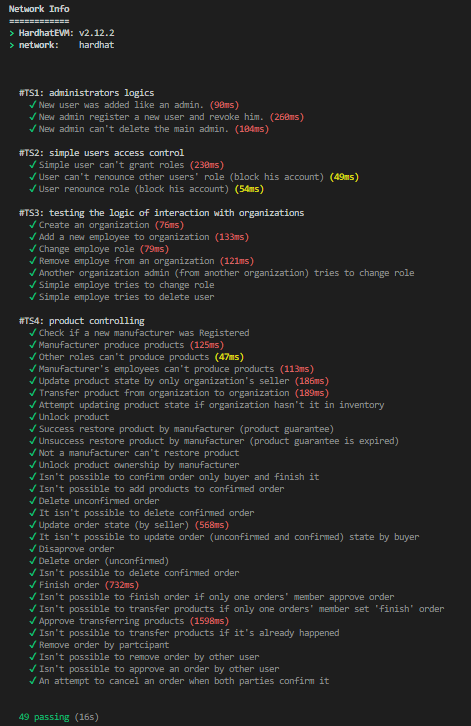
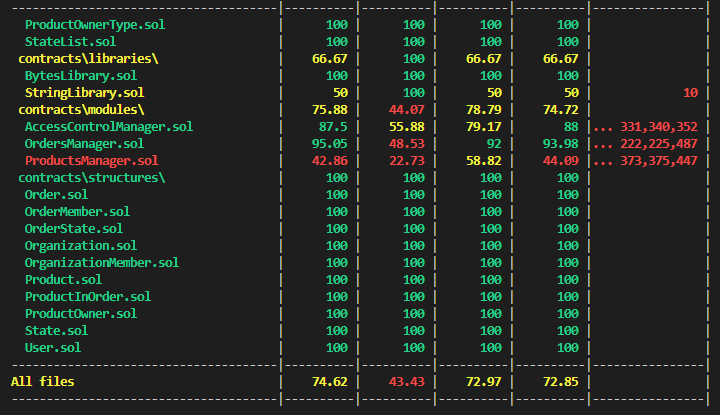

# Order Management System

The enterprise distributed application project repository (without the client application part).

This project was developed for a master's thesis on the topic "Order management system for security systems for vehicles based on Blockchain technology".

The main results of the work are described here.

## Problems analysis 

The traditional organization of supply chains and business has lost its relevance due to many problems that reduce business efficiency, carry various risks and affect participants in economic relationships:
- problems of scaling the supply chain, which appear when the chain becomes more complex as production capacities expand, the number of consumers increases, counterparties change, new outlets appear;
- territorial dispersion of enterprise divisions, which can be a problem in cases of production problems;
- problems of transparency, a common and fair system of control and trust between the buyer and the seller, which can be expressed in the manipulation of the market value by intermediaries, which allows you to receive additional profit at the expense of the end consumer, since there is no information and price transparency in the created classical methods of supply chain management;
- it should be noted that there is a possibility of fraud in transactions, when the paid goods will be of poor quality or the supplier will not at all answer for his obligations to the organization by the buyer;
- possible inadvertent spoilage of goods in parts of the supply chain, which is especially critical for the food industry, where the product may be contaminated or spoiled due to storage conditions;
- the possibility of the introduction of counterfeit products, replacement or theft at the links of the supply chain, which creates further economic risks for the organization, threats to the health of the consumer and material losses;
- quality problems can be expressed in the fact that often the product moves in one direction and if the product has defects, the consequences will be transferred to the consumer;
- errors arising from the fact that people who are subject to the human factor, which can be expressed in theft of products, incorrectly filled out documents, are involved in the processes of transportation and delivery, in addition, people who can make mistakes are also responsible for monitoring in logistics processes.
Thus, the above problems have a strong impact on the supply chain and its participants. Modern systems mainly rely on trusting relationships between people involved in the functioning of supply chains, and this dependence must be eliminated, which will reduce risks in processes, improve their quality and form trusting relationships between participants in economic relationships.

## Requirements

In this paper, to analyze business processes that are closely related in the supply chain, the REA ontology is used to model accounting systems for processes or organizing activities within an organization. Ontology mainly allows you to move from classical accounting to the presentation of data that are typical for computer information systems. Graphical models of this kind are a modified version of the ER diagram, and the conventions for describing relationships correspond to the conventions in classical ER diagrams. Unlike ER diagrams, it is customary to use 3 types of entities for REA diagrams: resources, events and agents

## Architectural design

### System's architecture

### Client-server interaction and client's architecture

### Technology stack

- Penpot;
- Hardhat for developing and deployment smart contract, testing;
- Blockchain GoQuorum;
- Docker for blockchain;
- Solidity language for smart contracts;
- OpenZeppelin library for smart contracts.

## Developing (MVP)
### What was done

As a result of design and development, they have the following functional features:
- provide access control to the order management system and delimit access to the functions of a distributed application;
- provide full accounting of all available assets of organizations connected to the system;
- provides processes for the transfer of assets between organizations;
- provide processes for creating orders, save the history of movements;
- provide privileged users in the system with the ability to produce products, restore them and exit from service;
- the smart contract is designed in such a way as to ensure its scalability when deployed in a production environment.

### Way of improvements

To improve the smart contract:
- it is possible to redesign its architecture in such a way that each module is a separate distributed application;
- finalize the logic of product ownership for the consumer;
- improve the logic of product support;
- finalize the logic of buying goods and crediting to the consumer's balance.

## UI Design for desktop app

To design UI I used Penpot. File with the project available in [folder](./docs/ui_design).

## Testing

Testing in the project was carried out partially and the main functions of the smart contract were tested. Not all tests were implemented.

### Info about contract testing

- [x] Test Suits 1: administrators logics (only primary)
  Testing the logic of administrator capabilities: assigning access rights to users, creating new privileged users, assigning administrators and not being able to change the access rights of other users with equal or higher rights

- [x] Test Suits 2: simple users access control (only primary) 
    Testing the logic of the user's ability to manage access rights: a regular user cannot assign roles and block other users, checking the possibility of blocking their own account

- [x] Test Suits 3: testing the logic of interaction with organizations (only primary) 
    Testing the logic of interaction with organizations in management:
    creation of an organization only for authorized users (by the system administrator), adding a new employee to the organization, changing the role of an organization member, deleting an employee, an attempt to change the role of an employee by an administrator of another organization, an attempt by a regular employee to change his own and someone else's role, or to delete another employee

- [x] Test Suits 4: product controlling (only primary) 
    Verify manufacturer registration, manufacture product by manufacturer, attempt other roles to produce, manufacturer employees cannot change production, update product status by organization employee, transfer products between organizations, other users attempt to transfer organization assets, attempt to update product status when not in own inventory organization, manufacturer unlocked product verification, manufacturer product unrepairable (if warranty expired), non-manufacturer unable to repair product, manufacturer ownership unlock verification, selling product to customer

- [x] Test Suits 5: orders interactions (only primary) 
    Check for creating a new order, adding a product (in vendor inventory) to an unconfirmed order, deleting products from an unconfirmed order, confirming an order, not being able to confirm an order by an outside supplier or customer and completing it, not being able to add products to a confirmed order, not being able to delete a confirmed order, updating status order (available only to the supplier), inability to update the status of the order by the supplier, check the refusal of the proposed order, delete only unconfirmed order, the inability to delete the confirmed order, check the completion of the order, check the completion of the order if only one of the participants confirmed it, the impossibility of transportation while the order is incomplete, confirmation of transfer of products from a completed order, the impossibility of re-transfer of products from a completed order, verification of an attempt to delete an order by an outside user, an attempt to cancel an order when both parties confirm it or

### Test results

You can see it [README.md](./smart_contracts/README.md).

## Conclusion

As a result of the work, a smart contract was implemented - the most significant, in the context of the study, part of the system. A smart contract has the following functional features:
- provide access control to the order management system and delimit access to the functions of a distributed application;
- provide full accounting of all available assets of organizations connected to the system;
- provides processes for the transfer of assets between organizations;
- provide processes for creating orders, save the history of movements;
- provide privileged users in the system with the possibilities of production, its restoration and decommissioning;
- the smart contract is designed in such a way as to ensure its scalability when deployed in a production environment.

Partial testing was carried out for the operation of the basic logic of the smart contract.